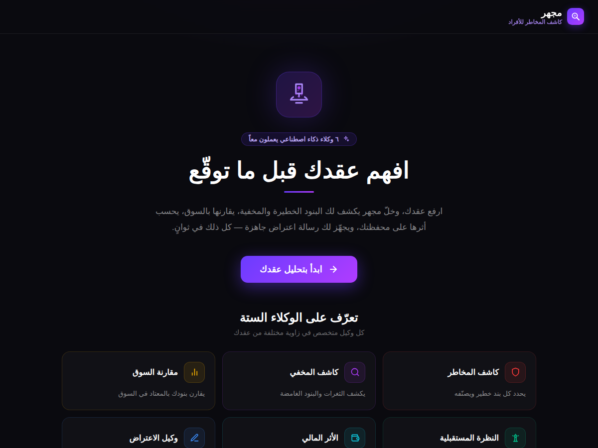
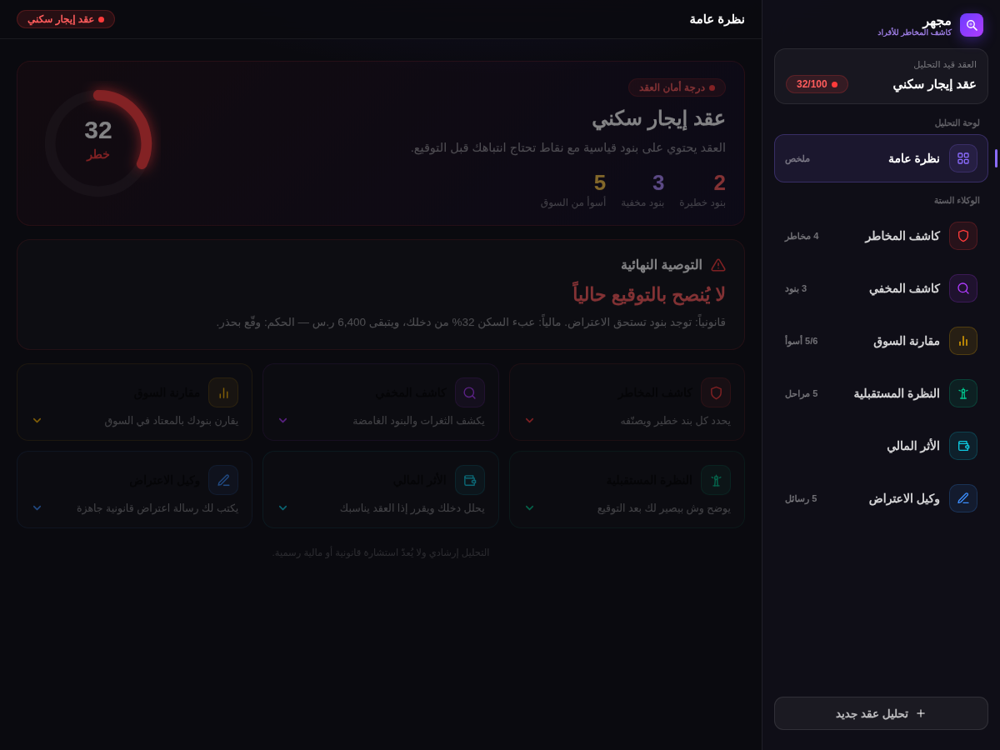
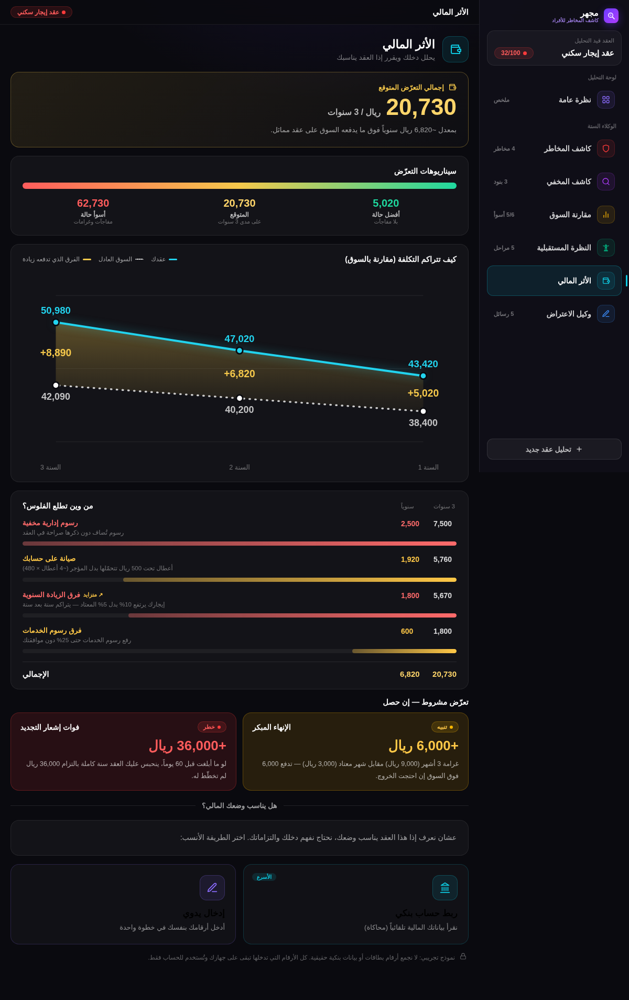

<div align="center">

# 🔍 مِجهر — كاشف المخاطر للأفراد

**افهم عقدك قبل ما توقّع.**

منصّة تحلّل عقودك (**إيجار · تمويل · استثمار**) عبر **٦ وكلاء ذكاء اصطناعي**،
وتكشف البنود الخطيرة والمخفية، تقارنها بالسوق، تحسب أثرها المالي،
وتكتب لك رسالة اعتراض جاهزة — كل ذلك في ثوانٍ.

### 🌐 [جرّب الموقع المباشر](https://mijhar-d2on.onrender.com)

</div>

---

## 📸 لقطات من الموقع

<div align="center">

| الصفحة الرئيسية | لوحة التحليل | الأثر المالي |
|:---:|:---:|:---:|
|  |  |  |

</div>

---

## 🤖 الوكلاء الستة

| # | الوكيل | المهمة |
|:---:|---|---|
| ١ | **كاشف المخاطر** | يحدد كل بند خطير ويصنّفه (خطر / تنبيه / آمن) مع ترجمة تبسيطية |
| ٢ | **كاشف المخفي** | يكشف الثغرات والبنود الغامضة المصاغة لتُخفي أثرها |
| ٣ | **مقارنة السوق** | يقارن بنودك بالمعتاد في السوق السعودي بالريال |
| ٤ | **النظرة المستقبلية** | يبني خطاً زمنياً لما سيحدث بعد التوقيع |
| ٥ | **الأثر المالي** | حاسبة تفاعلية تقرّر إن كان العقد يناسب وضعك المالي |
| ٦ | **وكيل الاعتراض** | يكتب رسائل اعتراض قانونية جاهزة بناءً على بقية الوكلاء |

> 📄 **صفحة شرح كاملة للمشروع:** افتح [`docs/about.html`](docs/about.html) في المتصفح.

---

## 📁 هيكل المشروع

```
Mijhar/
│
├── 📂 backend/              الخادم + الوكلاء الستة (Node.js + Express)
│   ├── src/
│   │   ├── agents/            وكيل لكل ملف (risks, hidden, market, future, financial, object, extract)
│   │   ├── data/              بيانات العقود الثلاثة + تعريف الوكلاء
│   │   ├── lib/               محرّك الأثر المالي + طبقة الذكاء الاصطناعي + أدوات
│   │   ├── orchestrator.js    ينسّق الوكلاء ويجمع النتيجة في تقرير واحد
│   │   └── server.js          واجهة API + تقديم الموقع
│   └── tests/                ٣٥ اختبار آلي (Vitest)
│
├── 📂 frontend/             الواجهة (React + Vite، عربية RTL)
│   └── src/
│       ├── App.jsx           التدفّق: الرئيسية ← الرفع ← التحليل ← اللوحة
│       ├── panels.jsx        لوحات الوكلاء
│       ├── financial.jsx     لوحة الأثر المالي + الحاسبة
│       ├── ui.jsx            المكوّنات (أيقونات، بطاقات، مخططات)
│       └── theme.js / api.js  الألوان والثوابت + الاتصال بالخادم
│
├── 📂 docs/                 صفحة الشرح + لقطات الموقع
├── render.yaml             إعداد النشر أونلاين
└── package.json            أوامر البناء والتشغيل الموحّدة
```

---

## 🚀 التشغيل محلياً

```bash
# ١) الباكند
cd backend && npm install && npm start      # http://localhost:8787

# ٢) الواجهة (نافذة أخرى)
cd frontend && npm install && npm run dev    # http://localhost:5173
```

ثم افتح `http://localhost:5173` في المتصفح.

### 🧪 الاختبارات

```bash
cd backend && npm test      # ٣٥ اختبار
```

---

## 🧠 الذكاء الاصطناعي

المشروع يعمل **بدون أي إعداد** (محرّك احتياطي ببيانات جاهزة). لتفعيل التحليل الحقيقي،
ضع **أحد** المفاتيح التالية في متغيّرات البيئة:

| المزوّد | المتغيّر | ملاحظة |
|---|---|---|
| **Groq** | `GROQ_API_KEY` | مجاني بدون بطاقة — [console.groq.com](https://console.groq.com/keys) |
| **Google Gemini** | `GEMINI_API_KEY` | مجاني — [aistudio.google.com](https://aistudio.google.com/apikey) |
| **Anthropic Claude** | `ANTHROPIC_API_KEY` | يحتاج رصيد — [console.anthropic.com](https://console.anthropic.com) |

> يمكن التحقق من عمل الذكاء عبر: `/api/selftest`

---

## 🛠️ التقنيات

`React (RTL)` · `Node.js + Express` · `بنية وكلاء متعددين` · `نماذج لغوية (LLM)` · `مخططات SVG تفاعلية` · `Vitest` · `منشور على Render`

---

## 📌 الحالة الحالية (بشفافية)

- ✅ **يعمل الآن:** تحليل حقيقي بالذكاء الاصطناعي لأي عقد، الوكلاء الستة، ٣ أنواع عقود، موقع منشور.
- 🟡 **نموذج أولي:** مرجعيات السوق قيم واقعية مُحاكاة (لا ربط مباشر بالجهات الرسمية بعد)، والمخرجات إرشادية وليست استشارة رسمية.
- 🔜 **قادم:** ربط مباشر (API) مع منصّة إيجار والبنك المركزي وهيئة السوق المالية وناجز.

---

## 👥 الفريق

**رانيا العتيبي** (قائدة الفريق) · **نورة العتيبي**

---

<div align="center">
<sub>مجهر أداة إرشادية لفهم العقود، ولا تُعدّ استشارة قانونية أو مالية رسمية.</sub>
</div>
